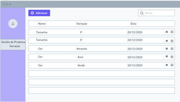
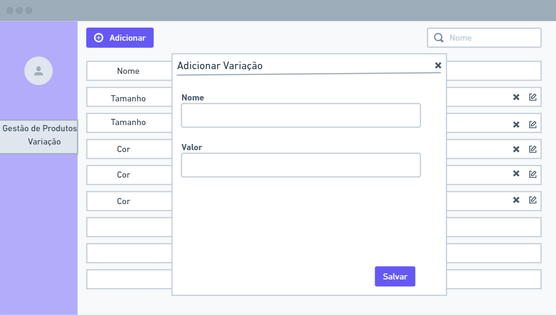

# Cadastro de variação

<p><strong>VALUE PROPOSITION</strong></p>

> **Como um** usuário do backoffice

> **Eu quero** consultar, criar, editar ou excluir variações de produto como cor e tamanho

> **Então** preciso de um cadastro de variação

<p><strong>ACCEPTANCE CRITERIA</strong></p>

- Não é possivel cadastrar variação com valores iguais

- Excluir uma variação altera o status para inativo

- Listar variações cadastradas

<p><strong>SCREEN DRAFTS</strong></p>

<p align="center">
  
  
</p>

<p><strong>USER STORY CARD</strong></p>

**Name:** Cadastrar variação

**Author:** 

- [Daniela Franciscatto](https://github.com/danielaanjos) 

**Date:** Jan 15, 2021

**Actors:**  

- usuário do backoffice

**Main Flow:**

1. Usuário clica em Gestão de produtos no menu lateral e seleciona Variação
2. Sistema exibe a tela com a lista de variação cadastradas.
3. Usuário clica no botão Adicionar
    1. Sistema exibe campos para cadastrar variação
        1. Informe o nome da variação
        2. Informe o valor da variação
        3. Clique em Salvar
    2. Sistema exibe variação na lista de variação cadastradas
4. End use case

**Postcondition:**

- variação cadastrada

**Messages:**

- mensagem de alerta (1) - Campos obrigatórios devem ser preenchidos

<p><strong>SCENARIOS</strong></p>

```gherkin
@CRUD_variation

Feature: register a category
    In order to I need create variation for products
    As a role permissioned I want register my vaariations

Background: visit manage product page
    Given I visit "/gestao-produtos" page
    And I select 'Variação' side-menu item

    Scenario: Register variation without name value
        When I click 'Salvar' button
        And field 'Nome' is <empty>
        Then I see a warning <message>
        And I can not register variation

    Scenario: Register variation without value variation
        When I click 'Salvar' button
        And field 'Valor' is <empty>
        Then I see a warning <message>
        And I can not register category 

    Scenario: Register variation with exists value variation
        When I fill 'Nome' field <value-nome>
        And I fill 'Valor' field <value-variation>
        And the <value-variation> already exists in the system
        Then I see a warning <message>
        And I can not register category 

     Scenario: delete a variation
        Given I visit "variação" page
        And I click "Excluir" button
        When I click "Sim" confirmation modal
        Then variation <status> turn to "inativo"
```