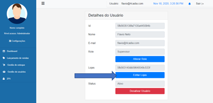
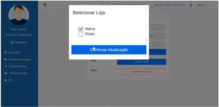

# Vincular loja usuário

<p><strong>VALUE PROPOSITION</strong></p>

> **Como um** 

> **Eu quero** 

> **Então** 

<p><strong>ACCEPTANCE CRITERIA</strong></p>

- Apenas o usuário que estiver na role admin ou supervisor pode acessar a lista de usuários

- Apenas o usuário que estiver na role admin ou supervisor pode vincular usuários cadastrados em lojas

- Cada usuário cadastrado pode ser vinculado a uma loja ou mais.

<p><strong>SCREEN DRAFTS</strong></p>

<p align="center">
  
  
</p>

<p><strong>USER STORY CARD</strong></p>

**Name:** Vincular loja usuário

**Author:** 

- [Daniela Franciscatto](https://github.com/danielaanjos) 

**Date:** Nov 12, 2020

**Actors:**  

- usuário admin

**Precondition:**

- Usuário estar na role administrador ou supervisor

**Main Flow:**

1. Usuário clica em Gestão de usuários no menu lateral
2. Sistema exibe a tela com a lista de usuários
3. Usuário clica no botão Editar ao lado de cada ítem da lista de usuários
    1. Sistema exibe página com informações do usuário selecionado
4. Usuário clica no botão Editar Loja
    1. Sistema exibe modal com checkbox list de lojas cadastradas
    2. Usuário seleciona loja a ser vinculada
    3. Clicar em salvar
5. Sistema exibe mensagem de sucesso ()
6. Fim do caso de uso

**Postcondition:**

- Usuário cadastrado na aplicação com loja vinculada

**Messages:**


<p><strong>SCENARIOS</strong></p>

```gherkin
@link_store_user
Feature: Link user to store
    In order to I need to register a store to a user
    As a admin or a supervisor user I want to edit stores of a registered users

    Background: access list users and select one
        Given I visit "/usuarios" page
        And I click edit button of a <user> at the list
        And system return "/usuarios-lojas" page to edit user store

        Scenario: Save user without linked store
            When I click <save> button
            And the selected user has no store
            Then I should see a sucess message
            And system return to "/usuarios" page

        Scenario: Save user with linked store
            When I click <save> button
            And the selected user has a chosen store
            Then I should see a sucess message
            And system return to "/usuarios" page
```