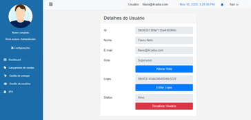
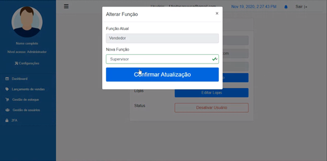

# Vincular role (função) usuário

<p><strong>VALUE PROPOSITION</strong></p>

> **Como um** usuário administrador ou supervisor da aplicação

> **Eu quero** vincular usuários as respectivas funções

> **Então** preciso de um cadastro de usuários com possibilidade de associação de função por usuário

<p><strong>ACCEPTANCE CRITERIA</strong></p>

- Apenas o usuário que estiver na role admin ou supervisor pode acessar a lista de usuários

- Apenas o usuário que estiver na role admin ou supervisor pode vincular usuários cadastrados em roles

- Cada usuário cadastrado pode ser vinculado a uma role

<p><strong>SCREEN DRAFTS</strong></p>

<p align="center">
  
  
</p>

<p><strong>USER STORY CARD</strong></p>

**Name:** Vincular role (função) usuário

**Author:** 

- [Daniela Franciscatto](https://github.com/danielaanjos) 

**Date:** Nov 19, 2020

**Actors:**  

- Usuário estar na role administrador ou supervisor

**Main Flow:**

1. Usuário clica em Gestão de usuários no menu lateral
2. Sistema exibe a tela com a lista de usuários
3. Usuário clica no botão Editar ao lado de cada ítem da lista de usuários
    1. Sistema exibe página com informações do usuário selecionado
4. Usuário clica no botão Alterar Função
    1. Sistema exibe modal com a função atual do usuário e um Dropdown button para seleção da nova função
    2. Usuário seleciona nova função
    3. Clicar em salvar
5. Sistema exibe mensagem de sucesso ()
6. Fim do caso de uso

**Postcondition:**

Usuário cadastrado na aplicação com função vinculada

**Messages:**


<p><strong>SCENARIOS</strong></p>

```gherkin
@link_role_user
Feature: Link user to a role
    In order to I need to define a role to a user
    As a admin or a supervisor user I want to edit roles of a registered users

    Background: access list users and select one
        Given I visit "/usuarios" page
        And I click edit button of a <user> at the list
        And system return "/usuarios-lojas" page to edit user role

    
        Scenario: Save user without linked role
            When I click <save> button
            And the selected user has no role
            Then I should see a warning message

        Scenario: Save user with linked role
            When I click <save> button
            And the selected user has a chosen role
            Then I should see a sucess message
            And system return to "/usuarios" page
```